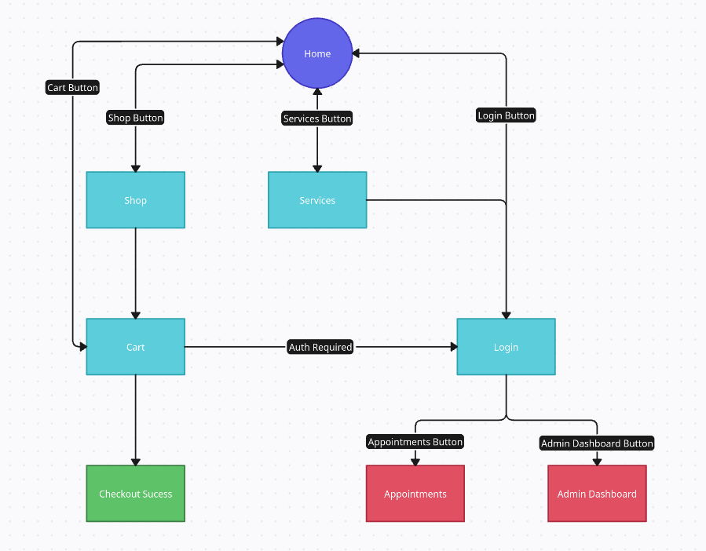

# Barber Shop Website

## Introduction

This project is a web-based system for a modern barber shop, developed as part of a Web Development course. The system is designed to provide customers with easy access to essential information about the barber shop, its services, and products, as well as to facilitate the scheduling of appointments. The platform emphasizes a clean and user-friendly interface to enhance the customer experience.

## Navigation Diagram

The following diagram illustrates the structure and navigation flow between the main pages of the system:

## Requirements

The core requirements are specified in the course assignment and include:

- A responsive website with multiple interconnected pages
- Implementation of an online store
- Shopping cart functionality
- User login system
- Appointment booking page

Additional requirements added to this implementation:

- Clean, intuitive, and responsive design using only HTML and CSS
- A static, yet visually structured cart page
- Placeholder login interface for future integration with back-end logic
- Reuse of common interface elements (navbar and footer) across all pages to enhance maintainability

## Project Description

In this first milestone, we focused on implementing the visual layout and navigation of the main pages using HTML and CSS only. The pages include:

- **Home**: A landing page introducing the brand and featuring links to services and shop sections.
- **Services**: A list of available services such as haircuts, beard trimming, and grooming, each with pricing and descriptions.
- **Shop**: A product catalog layout displaying barber shop items like grooming kits, hair products, and accessories.
- **Cart**: A page where selected products are displayed, with options to remove or modify items (layout only).
- **Login**: A static form to simulate user authentication, serving as a placeholder for future integration.
- **Appointments**: A structured layout allowing users to browse available time slots and select services (non-functional at this stage).

Navigation between these pages is handled through internal links, and the layout adapts to different screen sizes, ensuring a responsive user experience.

## Comments About the Code

_(To be added)_

## Test Plan

_(To be added)_

## Test Results

_(To be added)_

## Build Procedures

_(To be added)_

## Problems

_(To be added)_

## Comments

_(To be added)_
