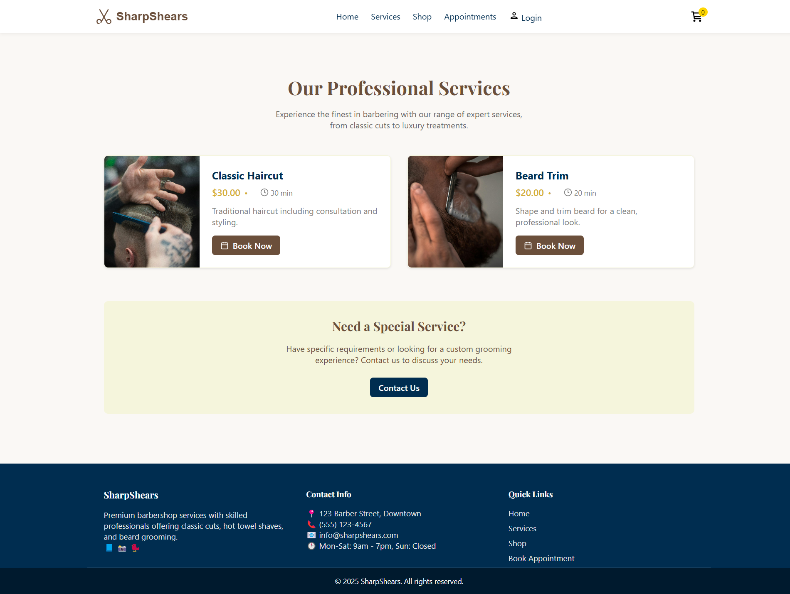

# Barber Shop Website

## Members

- Bruno Basckeira Chinaglia - 14562233
- Miguel Rodrigues Tomazini - 14599300

## Introduction

This project is a web-based system for a modern barber shop, developed as part of a Web Development course. The system is designed to provide customers with easy access to essential information about the barber shop, its services, and products, as well as to facilitate the scheduling of appointments. The platform emphasizes a clean and user-friendly interface to enhance the customer experience.

## Navigation Diagram

The following diagram illustrates the structure and navigation flow between the main pages of the system:


## Screenshots

Below are screenshots of the main pages implemented so far:

### Home Page


Landing page introducing the brand, with quick links to services and shop sections.

---

### Services Page



Displays the list of available services, descriptions, and pricing information.

---

### Shop Page


Product catalog showcasing items such as grooming kits, hair products, and accessories.

---

### Cart Page


Static cart layout displaying selected products, with options to modify or remove (not functional yet).

---

### Login Page


Simple login form acting as a placeholder for future authentication features.

---

### Appointments Page


Structured layout allowing users to select available time slots for services (visual only).

---

### Admin Dashboard Page


Admin view with a structured layout to visualize and select available time slots for services (visual only).

---

## Requirements (Milestone 2 Focus)

The core requirements are specified in the course assignment. For Milestone 2, the focus is on client-side functionality:

**Fulfilled from Assignment:**

- **User Types:** Implemented distinct experiences for "Clients" and "Administrators" using a mock authentication system.
    - **Administrators:** Can log in with "admin/admin" credentials. *(Specify what admin functionalities are implemented, e.g., view/manage products if `json-server` is used for this).*
    - **Clients:** Can log in with "client@example.com/password" or browse as guests. Can add items to cart, simulate checkout.
- **Admin Record:** (Simulated) Admin user has `name`, `id`, `phone`, `email` (as per `AuthContext`).
- **Customer Record:** (Simulated) Client user has `name`, `id`, `address`, `phone`, `email` (as per `AuthContext`).
- **Product/Service Records:** Products include `name`, `id`, `photo`, `description`, `price`, `quantity` (in stock), and `quantity_sold` (simulated update in `json-server` or `localStorage` upon mock purchase).
- **Selling Products/Services:**
    - Products can be selected, quantity chosen, and added to a functional cart.
    - Purchases are simulated using any credit card number.
    - (Simulated) Product stock is decremented, and `quantity_sold` is incremented upon mock purchase.
    - Carts are emptied upon (simulated) payment or by user action.
- **Product/Service Management (Admin):** *(Detail what is implemented. E.g., "Administrators can view a list of products. CRUD operations for products are simulated using `json-server`, allowing changes to stock quantity.")*
- **Specific Functionality:** Our barbershop theme includes distinct sections for booking services and purchasing grooming products, providing a comprehensive online presence for the business.
- **Accessibility & Usability:** The system aims for good usability with clear navigation and responsive design. Semantic HTML and ARIA attributes are used where appropriate. *(Be more specific if you have concrete examples).*
- **Responsiveness:** The application adapts to various screen sizes, ensuring functionality and readability across devices.

## Project Description (Milestone 2 Update)

This milestone focuses on implementing the client-side functionality of the "SharpShears" barbershop website. Building upon the HTML/CSS mockups from Milestone 1, we have now integrated JavaScript (via React/Next.js) to create interactive and dynamic user interfaces.

**Key functionalities implemented:**

- **User Authentication:** A mock login system allows users to sign in as either a "client" or an "admin," with session data stored in `localStorage`.
- **Product Catalog & Shop:** Products are dynamically fetched from a `json-server` instance (serving `db.json`) and displayed on the shop page. Users can view details and add products to their cart.
- **Shopping Cart:** A fully functional shopping cart allows users to add/remove items, update quantities, and view the subtotal. Cart data is persisted in `localStorage`.
- **Checkout Simulation:** A visual checkout process allows users to enter mock payment details. Upon "successful" payment, the cart is cleared, and a confirmation page is displayed. (Simulated) Stock levels are adjusted.
- **Services Display:** Services are listed, providing information to users. *(Mention if booking is functional, even if simulated).*
- **Admin Functionalities (Basic):** *(Detail what admins can do, e.g., "Admins have a dedicated dashboard and can manage product listings by interacting with the `json-server` backend for CRUD operations on products, including stock updates.")*
- **Responsive Design:** Continued focus on ensuring the application is usable across different device sizes.
- **Navigation:** All major pages are interconnected and accessible through the navigation bar and other UI elements.

The project uses React for building components, Next.js for routing and structure, Tailwind CSS for styling, and `json-server` to simulate a backend API for product data. Client-side state (cart, authentication) is managed using React's Context API.

## Comments About the Code

- The project is structured using Next.js's App Router, promoting a clear separation of pages, components, and contexts.
- Reusable UI components (e.g., `Button`, `Input`, `Navbar`, `Footer`) are created to ensure consistency and maintainability.
- State management for global concerns like authentication and shopping cart is handled via React Context API (`AuthContext`, `CartContext`).
- Tailwind CSS is used for styling, allowing for rapid UI development with utility-first classes.
- `json-server` is utilized to mock a RESTful API for product data, facilitating client-side development without a full backend.

## Test Plan

- Tested admin login with "admin/admin": successfully redirected to a page with access to the "Appointments" and "Dashboard" sections via the navigation bar.
- Tested client login with "client@example.com/password": successfully redirected to a page with access to the "Appointments" section via the navigation bar.
- Tested adding and removing products in the cart: the cart updated dynamically and changes were correctly reflected in localStorage. Users can add products by clicking the "+" button, decrease quantity with the "-" button, or remove the item completely using the "Remove" button — all located in the same box as the product.
- Tested adding products from both the Home and Shop pages: clicking "Add to Cart" increases the quantity in the cart by 1 (if the product is still in stock).
- Tested appointment scheduling: clients can schedule an appointment either from the "Appointments" page or by scrolling to the bottom of the Home page and clicking the "Book your appointment" button. Anyone can schedule an appointment, but since there is no database connection yet, appointments are not saved or displayed on the admin dashboard.
- Tested checkout process without providing credit card information: the system correctly displays a message prompting the user to enter valid payment data.
- Tested responsive design using Chrome Developer Tools: all UI components adapted properly to different screen sizes.


## Test Results

All manual tests were successfully completed. Implemented features (mock login, cart functionality, product listing, and checkout simulation) worked as expected. No critical bugs were found. Minor layout adjustments were made to improve responsiveness on small screens.

## Build Procedures

To set up and run this project locally (Milestone 2 - Client Functionality with Mock Backend):

1.  **Prerequisites:**
    *   Node.js (v18.x or later [text](barbershop_app/app/components/sections)recommended)
    *   npm or yarn

2.  **Clone the Repository:**
    ```bash
    git clone <your-repository-url>
    cd <project-directory-name>
    ```

3.  **Install Dependencies:**
    ```bash
    npm install
    # or
    yarn install
    ```

4.  **Prepare Mock Backend (`json-server`):**
    *   Ensure you have a `db.json` file in the root of your project (or specified path) containing your mock product and service data.
    *   In a separate terminal window, start `json-server`:
        ```bash
        npx json-server --watch db.json --port 3001
        ```
        *(This will serve your `db.json` data at `http://localhost:3001`)*

5.  **Run the Next.js Development Server:**
    *   In another terminal window, from the project root:
        ```bash
        npm run dev
        # or
        yarn dev
        ```

6.  **Access the Application:**
    *   Open your web browser and navigate to `http://localhost:3000`.

The application should now be running, with client-side functionalities interacting with the mock `json-server` backend on port `3001`.

## Problems

No problems encountered during the implementation of Milestones 1 and 2.

## Comments

Only the first step of the extra functionality was implemented. From the user's perspective, it is possible to schedule an appointment. However, on the admin dashboard, the "Services", "Clients", and "Appointments" tabs are not yet functional. These features are planned to be completed in the next milestone, as they depend on database integration.
